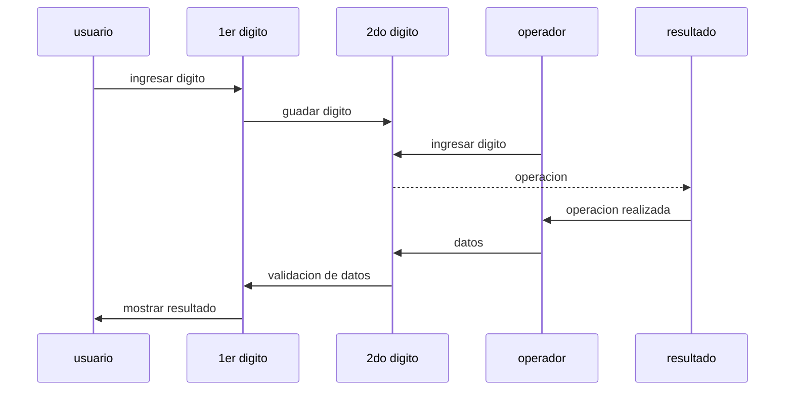

# diagrama

```mermaid
sequenceDiagram
    usuario->>1er digito: ingresar digito
    1er digito->>2do digito: guadar digito
    operador->>2do digito: ingresar digito
    2do digito-->>resultado: operacion
    resultado->>operador: operacion realizada
    operador->>2do digito: datos
    2do digito->>1er digito: validacion de datos
    1er digito->>usuario: mostrar resultado 
```
