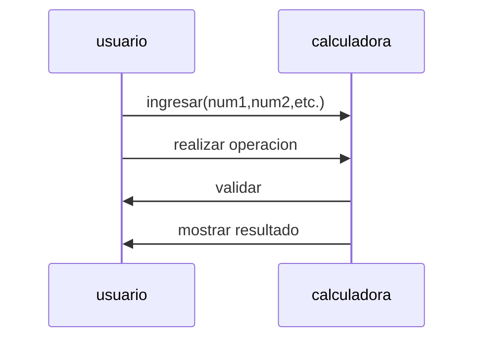

# diagrama

```mermaid
sequenceDiagram
    usuario->>calculadora:ingresar(num1,num2,etc.)
    usuario->>calculadora:realizar operacion
    calculadora->>usuario:validar 
    calculadora->>usuario:mostrar resultado
    
    
```
