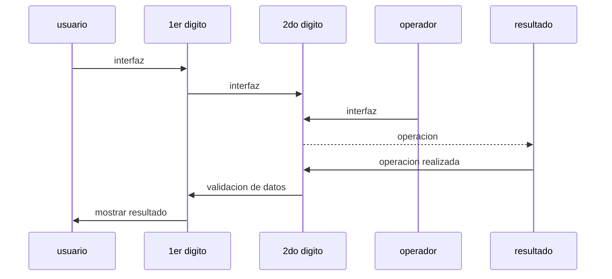

# diagrama

```mermaid
sequenceDiagram
    usuario->>1er digito: interfaz
    1er digito->>2do digito: interfaz
    operador->>2do digito: interfaz
    2do digito-->>resultado: operacion
    resultado->>2do digito: operacion realizada
    2do digito->>1er digito: validacion de datos
    1er digito->>usuario: mostrar resultado 
```
